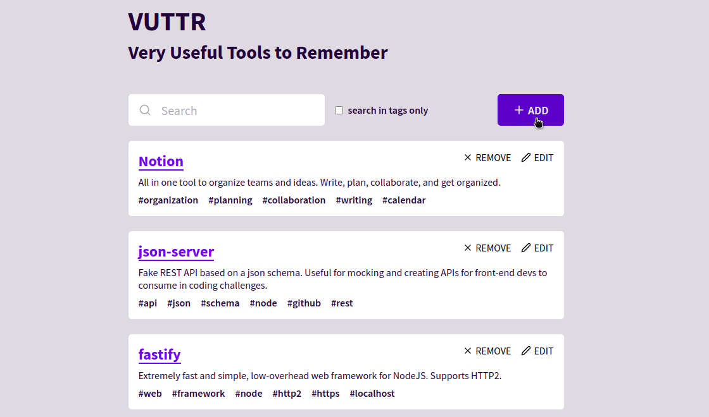

<h1 align="center">Very Useful Tools to Remember</h1>

 

  

 

## 💥 Tecnologias

Esse projeto foi desenvolvido com as seguintes tecnologias:

- [ReactJS](https://reactjs.org/)
- [TypeScript](https://www.typescriptlang.org/)
- [Styled Components](https://styled-components.com/)
- [React Router DOM](https://reactrouter.com/web/guides/quick-start)
- [React Icons](https://react-icons.github.io/react-icons/)
- [Polished](https://polished.js.org/)
- [Unform](https://unform.dev/)
- [Axios](https://github.com/axios/axios)
- [JSON Server](https://github.com/typicode/json-server)

## 💻 Projeto

O VUTTR (Very Useful Tools to Remember) é um simples repositório para gerenciar ferramentas com seus respectivos nomes, links, descrições e tags.

## 🚀 Começando

### Requisitos

- [NodeJS](https://nodejs.org/en/)
- [Yarn](https://yarnpkg.com/) ou [NPM](https://www.npmjs.com/)

1. Clone este repositório usando: `git clone https://github.com/orenatodos/vuttr.git`
2. Mova para o diretório apropriado: `cd vuttr`.  
3. Execute `yarn` ou `npm install` para instalar as dependências.  
4. Execute `npx json-server db.json --port 3333`  
5. Execute `yarn start` ou `npm start` para visualizar o projeto em: `http://localhost:3000`.

---

Feito com ♥ por Renato Silva 👋 [Entre em contato!](https://www.linkedin.com/in/orenatodos/)
